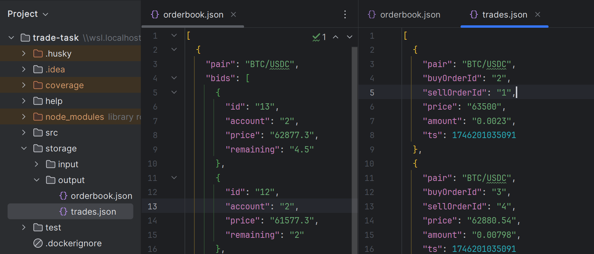
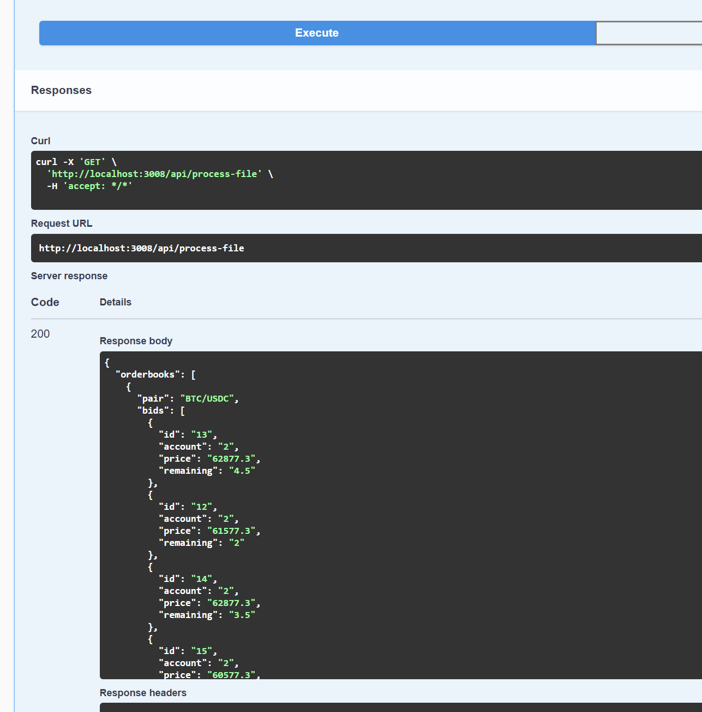
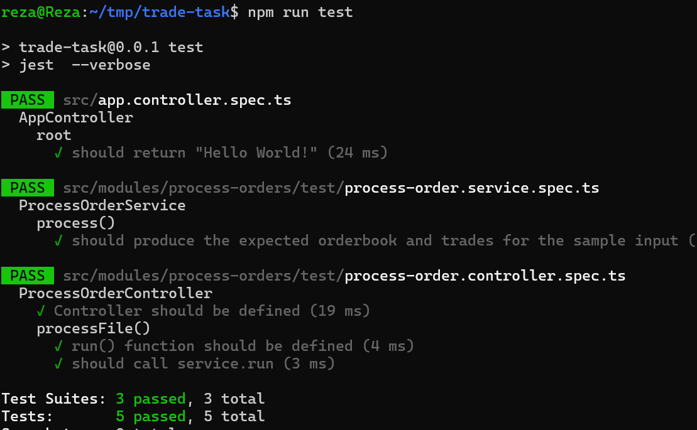

## Description
#### process orders from the file orders.json:

* **Heaps vs arrays** –  peek/push/pop in `O(log n)`;  faster than resorting arrays.
* **Big.js** keeps financial decimals exact (no $0.1 + 0.2 = 0.300000000004$ ).
* **Streaming JSON**  you can handle orders without blowing RAM.


### Swagger UI (for Docker, port is 3008)
http://localhost:3001/docs

http://localhost:3008/docs




## Running the app with Docker

```bash
# development
# http://localhost:3008/docs
docker compose -f docker-compose.dev.yml up

# or run with 
npm run docker:dev

```


## Running the app locally(Node.js)


#### Running the app

```bash
# development
npm run start

# watch mode
npm run start:dev

# production mode
npm run start:prod
```

#### Test

```bash
# with docker
npm run docker:dev

# -----------------------------

# unit tests
npm run test


# test coverage
npm run test:cov
```



## Info:
- 📌 nestjs.com


#### Done:
- ✅ Docker
- ✅ Unit Tests
- ✅ Add Swagger UI.
- ✅ Husky for git commits.


#### Todo:
- 💡 input validation
- 💡 Caching with Redis
- 💡 How handle large files?
- 💡 SOLID rules
- 💡 Docker volume mount!
- 💡 Include API versioning, 
- 💡 rate-limiting, 
