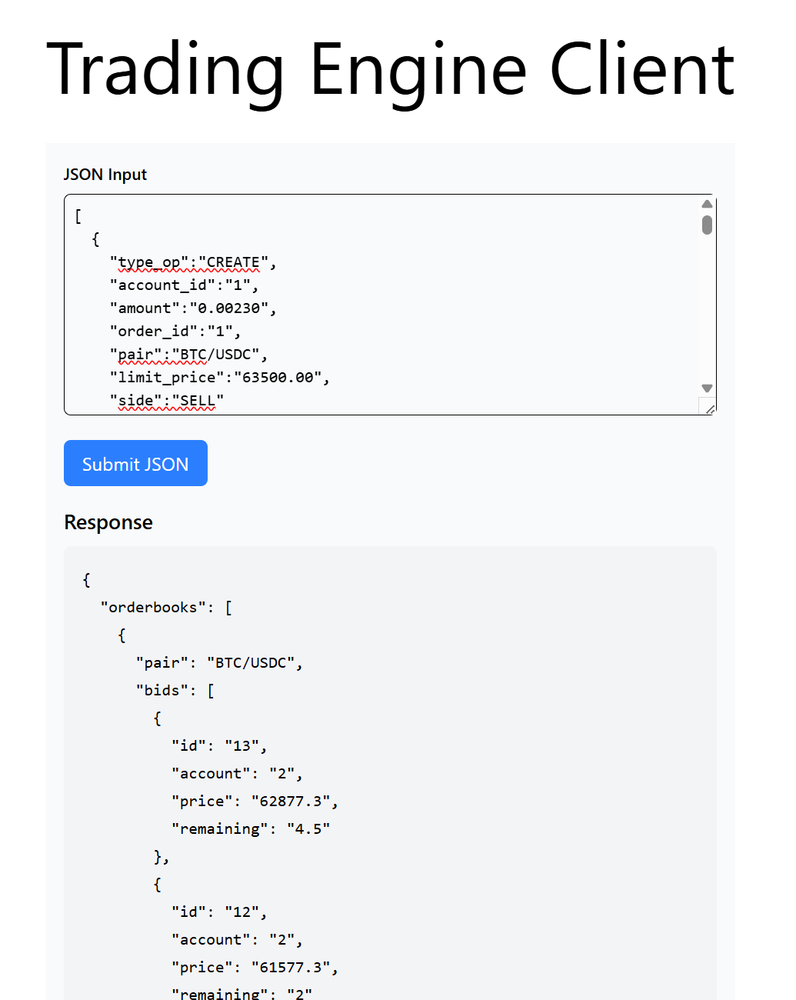

### Trading Engine Client

##### A web client for the tool built:
Just a simple web form for submitting orders in JSON format. You need to have the backend services running before starting the client. You will see the result below the form. Please check the picture.




## How to use

- Run `cd next-app`, then run `npm install` or `yarn install` or `pnpm install` to generate a lockfile.


### Local Development

First, run the development server:

```bash
npm run dev
```
Open [http://localhost:3000](http://localhost:3000) with your browser to see the result.

##### Docker:
```bash

# Build dev
docker compose -f compose.dev.yaml build

# Up dev
docker compose -f compose.dev.yaml up
```


[http://localhost:4000](http://localhost:4000)


## Useful commands

```bash
# Stop all running containers
docker kill $(docker ps -aq) && docker rm $(docker ps -aq)

# Free space
docker system prune -af --volumes
```
